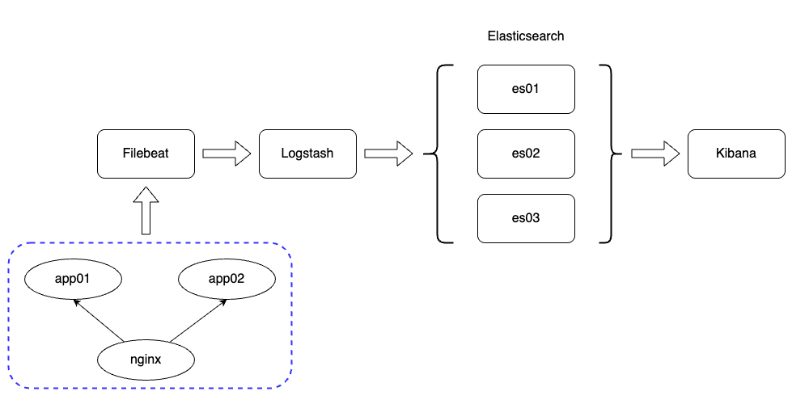

# 概要

Elastic Stackを使用してログを取り扱う練習をするためのサンプルです。
構造はシンプルに２つのアプリとnginxを起動して、そのログをElasticsearchに溜めてKibanaで閲覧可能にします。



# サンプルの起動方法

## アプリのビルド

Springのサンプルプログラムは./logdemo/Makefileを使って以下を実行してビルドしてください。

```bash
make image
```

以下のコンテナイメージが生成されます。

- localhost/logdemo:0.1.0

## 環境の起動方法

アプリをビルドしたらpodman compose upでコンテナを起動します。

## 動作確認

es01へはhttp://localhost:8080、es02へはhttp://localhost:8081 にそれぞれアクセスしてください。
また、InternalServerErrorを発生させるにはhttp://localhost:8080/throwにアクセスしてください。es02の方も同様です。


# 参考リンク
- [Elasticsearch - Doc](https://www.elastic.co/docs/deploy-manage/deploy/self-managed/install-elasticsearch-docker-compose)
- [Kibana - Doc](https://www.elastic.co/docs/deploy-manage/deploy/self-managed/install-kibana-with-docker)
- [ELK - Docker Compose](https://www.elastic.co/docs/deploy-manage/deploy/self-managed/install-elasticsearch-docker-compose)
- [Elastic StackとDocker Composeを使いはじめる：パート1](https://www.elastic.co/jp/blog/getting-started-with-the-elastic-stack-and-docker-compose)